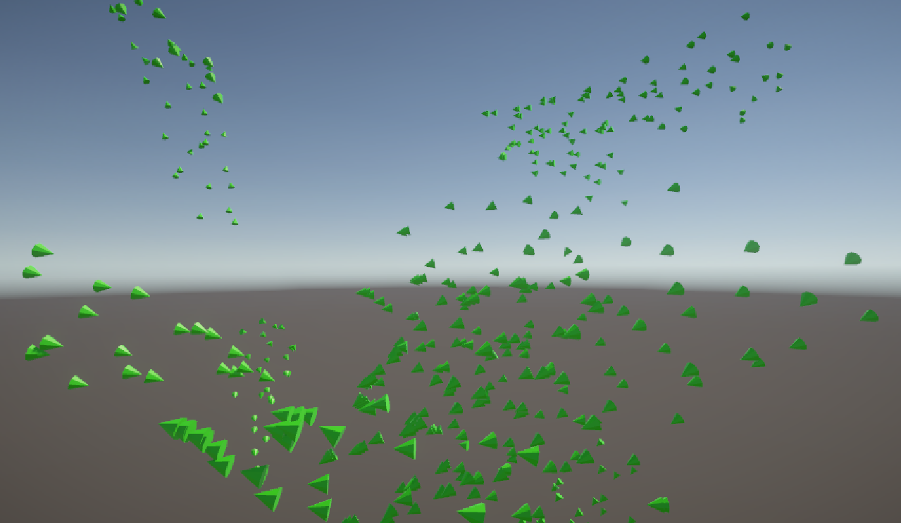

# Introduction
This will be my attempt to recreate Boids using my methods and those found online. I was given a general date of 3-5 days to work on this project. Below, I'll review some of the research that went into this and some methodologies used for these Boids. This project is free for anyone to use; however, this is not a fully prepared asset and needs some features of Boids that I will discuss in more detail below.

# What are Boids?
To take a quote from Craig W. Reynolds's original paper on the subject, "The simulated flock is an elaboration of a particle system, with the simulated birds being the particles." This motion is created with a distributed behavioral model, where the birds make their course based on their "local perception of the dynamic environment, the laws of simulated physics that rule its motion, and a set of behaviors programmed into it by the 'animator.'"  
A way to think of Boids is that they're an advanced particle system featuring geometry while interacting  with one another. "Boid behavior is dependant not only on the internal state but also on external state." While the object's flying follows set rigid motions, the object's underlying geometric model is free to articulate or change shapes within this "flying coordinate system."  

# The Basic Rules
The basic rules, stated in order of decreasing precedence, the behavior that leads to simulated flocking are:
1. Collision Avoidance: avoid collisions with nearby flockmates
2. Velocity Matching: attempt to match velocity with nearby flockmates
3. Flock Centering: attempt to stay close to nearby flockmates  

A more simplified version of these rules would be:  
1. Separation
2. Alignment
3. Cohesion

# The Boids at work

 

# Additional Resources
 If you wish to learn more info about what a "Boid" is, I recommend checking out the following resources:  
 
Sebastian Lague | https://www.youtube.com/watch?v=bqtqltqcQhw  
Dawn Studio | https://dawn-studio.de/tutorials/boids/
Original Boids Research Paper | https://www.cs.toronto.edu/~dt/siggraph97-course/cwr87/  

 Written and updated by Adam Kaci.
