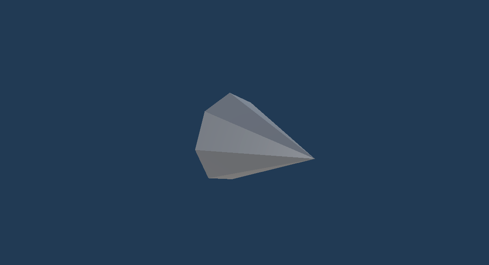
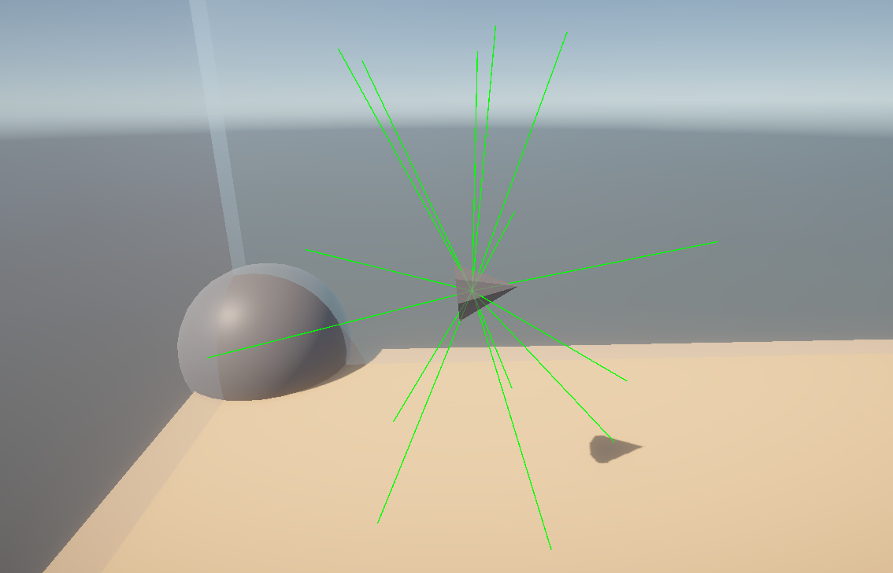
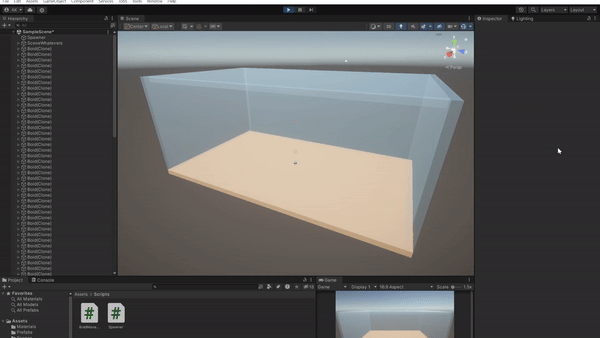

# Introduction
This will be my attempt to recreate Boids using my methods and those found online. I was given a general date of 3-5 days to work on this project. Below, I'll review some of the research that went into this and some methodologies used for these Boids. This project is free for anyone to use; however, this is not a fully prepared asset and needs some features of Boids that I will discuss in more detail below.

# What are Boids?
To take a quote from Craig W. Reynolds's original paper on the subject, "The simulated flock is an elaboration of a particle system, with the simulated birds being the particles." This motion is created with a distributed behavioral model, where the birds make their course based on their "local perception of the dynamic environment, the laws of simulated physics that rule its motion, and a set of behaviors programmed into it by the 'animator.'"  
A way to think of Boids is that they're an advanced particle system featuring geometry while interacting  with one another. "Boid behavior depends not only on the internal state but also on the external state." While the object's flying follows set rigid motions, the object's underlying geometric model is free to articulate or change shapes within this "flying coordinate system."  

# The Basic Rules
The basic rules, stated in order of decreasing precedence, the behavior that leads to simulated flocking are:
1. Collision Avoidance: avoid collisions with nearby flockmates
2. Velocity Matching: attempt to match velocity with nearby flockmates
3. Flock Centering: attempt to stay close to nearby flockmates  

A more simplified version of these rules would be:  
1. Separation
2. Alignment
3. Cohesion

# Early Implementation
After we apply all of the previously mentioned rules, we get a semi-functional boid. While not overtly intelligent, it can handle the basic stimuli of the outside world and dynamically adapt to what's around it. However, it's important to note that all the internal calculations a Boid does are multiplied tenfold once you have an entire flock active. The CPU must constantly check every frame for changes to adjust the Boid's local movement. Additionally, with the current method we're using, there's also an additional obstacle check where raycasts are sent out every frame to see any nearby obstacles and to adapt that Boid's local path, if any. This CPU bottleneck must be addressed to have these Boids be useable at higher numbers.  

 

# The Boids at work
An Early clip of a hundred Boids moving with no Obstacles obscuring their path

 

# Additional Resources
 If you wish to learn more info about what a "Boid" is, I recommend checking out the following resources:  
 
Sebastian Lague | https://www.youtube.com/watch?v=bqtqltqcQhw  
Dawn Studio | https://dawn-studio.de/tutorials/boids/
Original Boids Research Paper | https://www.cs.toronto.edu/~dt/siggraph97-course/cwr87/  

 They are written and updated by Adam Kaci.
